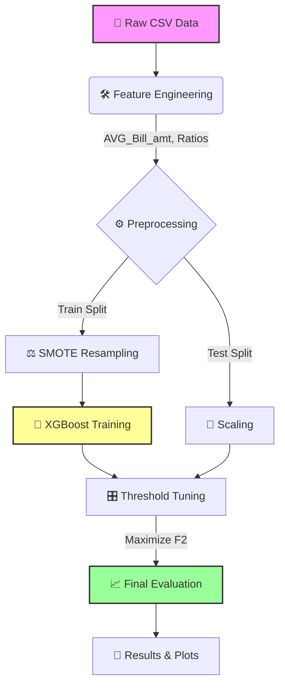

# 💳 Finance Club Project - Credit Default Prediction

> **Goal**: Predict credit card defaults with a focus on **Recall** (capturing risk) using an F2-Score optimized XGBoost pipeline.

> [!TIP]
> *   **Problem Statement**: [Finclub Summer Project 2 (2025).pdf](Finclub%20Summer%20Project%202%20(2025).pdf)
> *   **Final Report**: [Finance_club_ML_project_Report.pdf](Finance_club_ML_project_Report.pdf)
> *   **Experimental Notebook**: [Finance_club_project (2).ipynb](notebooks/Finance_club_project%20(2).ipynb)

---

## 📊 Pipeline Architecture



---

## 🚀 Key Features

| Feature | Description |
| :--- | :--- |
| **Modular Design** | Separation of `Data`, `Features`, and `Models` for production readiness. |
| **F2-Score Focus** | Optimized specifically to catch defaulters (High Recall) over simple accuracy. |
| **Smart Tuning** | Threshold optimization loop (`0.01` to `1.0`) to find the perfect cut-off. |
| **Visual Artifacts** | Automatically generates **ROC**, **PR Curves**, and **Confusion Matrices** per run. |

---

## 📂 Project Structure

```text
FinanceClub_Project/
├── 📄 main.py                  # 🚀 Pipeline Entry Point
├── 📂 config/
│   └── config.yaml             # ⚙️ Hyperparameters & Paths
├── 📂 data/
│   └── raw/                    # 📥 Input: train_dataset_final1.csv
├── 📂 logs/                    # 📝 Execution Logs
├── 📂 results/                 # 📊 Outputs (Metrics, Plots, Predictions)
│   └── run_20231228_.../       #    Timestamped Artifacts
├── 📂 src/
│   ├── 🛠️ features/            #    Engineering, Preprocessing, Resampling
│   ├── 🤖 models/              #    XGBoost Trainer, Tuner
│   └── 🔌 data/                #    Loaders
└── 📦 requirements.txt         #    Dependencies
```

---

## ⚡ Quick Start

### 1. Install Dependencies
```bash
pip install -r requirements.txt
```

### 2. Run Pipeline
```bash
python main.py
```

### 3. View Results
Checking `results/` will show:
*   `metrics.json`: Accuracy, Precision, Recall, F2, AUC.
*   `roc_curve.png`: Model discrimination performance.
*   `feature_importance.png`: What drives the predictions?

---

## 🧠 Model Details

> [!NOTE]
> The model uses **XGBoost** with a heavily weighted positive class (`scale_pos_weight: ~6.38`) to address the 80/20 class imbalance.

*   **Algorithm**: XGBoost Classifier
*   **Best Params**: `n_estimators: 300`, `max_depth: 7`, `learning_rate: 0.05`
*   **Imbalance Strategy**: SMOTE (Synthetic Minority Over-sampling) on Training Data only.

---
*Generated for Finance Club Project Refactoring*
